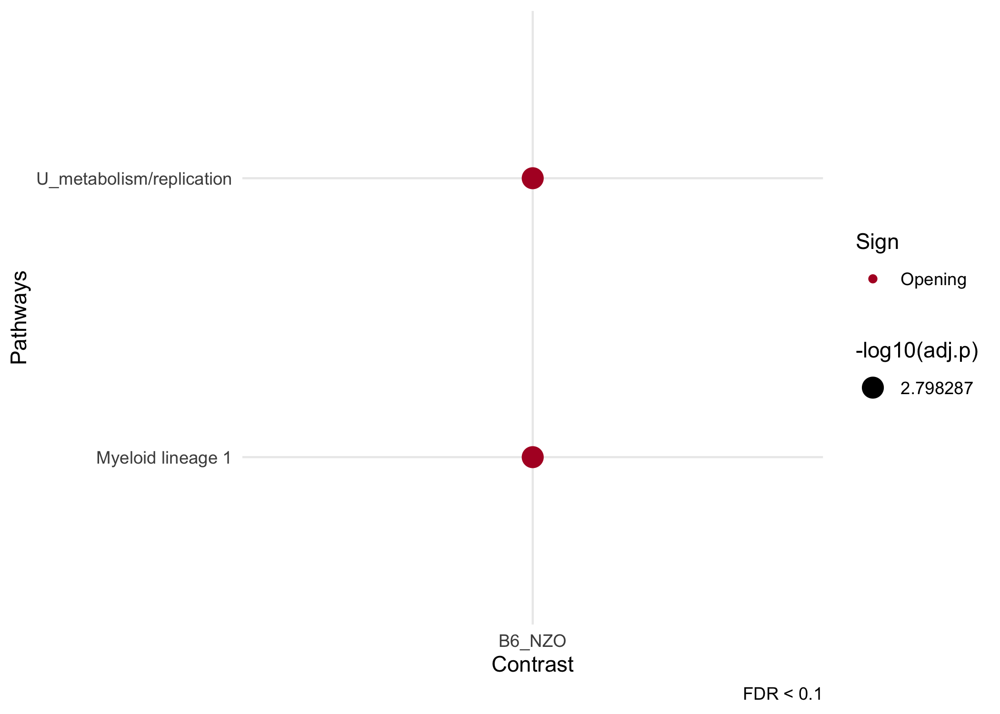

<!-- README.md is generated from README.Rmd. Please edit that file -->

# cinaR


   
`cinaR` is a single wrapper function for end-to-end computational
analyses of bulk ATAC-seq profiles. It starts from a consensus peak file
and outputs Differentially Accessible (DA) peaks and Enrichment Analyses
results.

<br/>

## Installation

``` r
library(devtools)
install_github("eonurk/cinaR")
```

## Quick Start

``` r
library(cinaR)
data("atac_seq_consensus_bm")
```

Bed formatted consensus matrix (chr, start, end and samples)

``` r
dim(bed)
## [1] 1000   25
```

``` r
# bed formatted file
head(bed[,1:4])
##         Chr     Start       End B6-18mo-M-BM-47-GT18-01783
## 52834  chr5  24841478  24845196                       1592
## 29780 chr17   8162955   8164380                        109
## 67290  chr8  40577584  40578029                         72
## 51295  chr4 145277698 145278483                        110
## 4267   chr1 180808752 180815472                       2452
## 45102  chr3  88732151  88732652                         49
```

Create the contrasts you want to compare, here we create contrasts for
22 mice samples from different strains.

``` r
# create contrast vector which will be compared.
contrasts<- c("B6", "B6", "B6", "B6", "B6", "NZO", "NZO", "NZO", "NZO", "NZO", "NZO", 
              "B6", "B6", "B6", "B6", "B6", "NZO", "NZO", "NZO", "NZO", "NZO", "NZO")
```

`cinaR` function directly computes the differentially accessible peaks.

``` r
# If reference genome is not set hg38 will be used!
results <- cinaR(bed, contrasts, reference.genome = "mm10")
## >> preparing features information...      2020-10-07 10:06:36 
## >> identifying nearest features...        2020-10-07 10:06:37 
## >> calculating distance from peak to TSS...   2020-10-07 10:06:38 
## >> assigning genomic annotation...        2020-10-07 10:06:38 
## >> assigning chromosome lengths           2020-10-07 10:07:03 
## >> done...                    2020-10-07 10:07:03 
## >> Method: edgeR
##  FDR: 0.05 & abs(logFC)< 0 
## >> Estimating dispersion...
## >> Fitting GLM...
## >> DA peaks are found!
## >> Converting mouse genes to human...
## >> Mouse to human mapping is created for all genes!
## >> Human gene symbols are converted to mice!
## >> Enrichment results are ready...
## >> Done!
```

Now, you can access differential accessibility (DA) and enrichment
results.

``` r
names(results)
## [1] "DA.results"         "Enrichment.Results"
```

There are many information `cinaR` provides such as adjusted p value,
log fold-changes, gene names etc for DA results:

``` r
colnames(results$DA.results$B6_NZO)
##  [1] "Row.names"     "seqnames"      "start"         "end"          
##  [5] "width"         "strand"        "annotation"    "geneChr"      
##  [9] "geneStart"     "geneEnd"       "geneLength"    "geneStrand"   
## [13] "geneId"        "transcriptId"  "distanceToTSS" "gene_name"    
## [17] "logFC"         "FDR"
```

Here is an overview of the DA results:

``` r
head(results$DA.results$B6_NZO[,1:5])
##                  Row.names seqnames     start       end width
## 1 chr1_134559439_134560787     chr1 134559439 134560787  1349
## 2 chr1_138158514_138159483     chr1 138158514 138159483   970
## 3 chr1_164247654_164251852     chr1 164247654 164251852  4199
## 4 chr1_171631196_171631780     chr1 171631196 171631780   585
## 5 chr1_173954537_173955745     chr1 173954537 173955745  1209
## 6 chr1_177935969_177936852     chr1 177935969 177936852   884
```

> Since the comparison is `B6_NZO`, if fold-changes are positive it
> means they are more accesible in B6 compared to NZO and vice versa for
> negative values\!

and here is a little overview for enrichment analyses results:

``` r
head(results$Enrichment.Results$B6_NZO[,c("overlapping.genes", "adj.p")])
##                                             overlapping.genes      adj.p
## Myeloid lineage 1         PLXNC1,GM2A,AGTPBP1,CTSB,TFEB,FBXL5 0.06091435
## U_metabolism/replication              PECAM1,GM2A,CTSB,SLC2A6 0.06091435
## U_mitochondrial proteins      PTPRC,MAP4K4,PIK3R1,PAQR3,UBE3A 0.33826666
## U_proteasome/ubiquitin cx                  PTPRC,PIK3R1,IREB2 0.36655302
## U_cAMP/NF-KB activation                RUNX1,RUNX1,ETS2,CCNG2 0.36655302
## U_Immunity/cytoskeleton                            RPS6,RPS19 0.56382267
```

You can plot your enrichment results using:

``` r
dot_plot(results)
```

<!-- -->

if it gets too crowded, you can get rid of the irrelevant pathways as
well:

``` r
dot_plot(results, filter.pathways = T)
```

<!-- -->

## Creating different contrasts

Note that you can further divide the resolution of contrasts, for
instance this is also a valid vector

``` r
contrasts <- sapply(strsplit(colnames(bed), split = "-", fixed = T), 
                    function(x){paste(x[1:4], collapse = "-")})[4:25]
unique(contrasts)
## [1] "B6-18mo-M-BM"  "B6-18mo-F-BM"  "NZO-18mo-F-BM" "NZO-18mo-M-BM"
## [5] "B6-3mo-F-BM"   "B6-3mo-M-BM"   "NZO-3mo-F-BM"  "NZO-3mo-M-BM"
```

in this case, each of them will be compared to each other which will
result in 28 different comparisons.

## Running enrichment with different dataset

You can run the enrichment analyses with a custom geneset:

``` r
cinaR(..., geneset = new_geneset)
```

`geneset` must be a `.gmt` formatted symbol file. You can download
different genesets from this
[site](https://www.gsea-msigdb.org/gsea/downloads.jsp).

> You can use `read.gmt` function from `qusage` package to read genesets
> into your current environment.

Also, you can familarize yourself with the format by checking out :

``` r
# default geneset to be used
data("VP2008")
```

## Selecting different reference genomes

For now, `cinaR` supports 3 genomes for human and mice models:

  - `hg38`
  - `hg19`
  - `mm10`

You can set your it using `reference.genome` argument.

## Batch Effect Correction

If you suspect your data have unknown batch effects, you can use:

``` r
cinaR(..., batch.correction = T)
```

This option will run [Surrogate Variable
Analysis](http://bioconductor.org/packages/release/bioc/html/sva.html)
(SVA) and try to adjust your data for unknown batch effects. If however,
you already know the batches of the samples, you can simply set the
`batch.information` argument as well:

``` r
# batch information should be number a vector where
# the length of it equals to the number of samples.
cinaR(..., batch.correction = T, batch.information = c(rep(0, 11), rep(1,11)))
```

> Reminder - In our example data we have 22 samples

## Saving DA peaks to excel

Setting `save.DA.peaks = TRUE` in `cinaR` function will create a
`DApeaks.xlsx` file in the current directory. This file includes all the
comparisons in different tabs. Additionally, you can set the path/name
of the file using `DA.peaks.path` argument after setting `save.DA.peaks
= TRUE`.

For instance,

``` r
results <- cinaR(..., save.DA.peaks = T, DA.peaks.path = "./Peaks_mice.xlsx")
```

will create an excel file with name `Peaks_mice.xlsx` in the current
directory.

## Using different GLM algorithms

Currently, `cinaR` supports 4 different algorithms, namely;

  - edgeR
  - limma-voom
  - limma-trend
  - DESeq2

If not set, it uses `edgeR` for differential analyses. You can change
the used algorithm by simply setting `DA.choice` argument. For more
information, `?cinaR`

## Some useful arguments

``` r
# new FDR threshold for DA peaks
results <- cinaR(..., DA.fdr.threshold = 0.1)

# filters out pathways
results <- cinaR(..., enrichment.FDR.cutoff = 0.1)

# does not run enrichment pipeline
results <- cinaR(..., run.enrichment = FALSE)

# creates the piechart from chIpSeeker package
results <- cinaR(..., show.annotation.pie = TRUE)

# change cut-off value for dot plots
dot_plot(..., fdr.cutoff = 0.05)
```

## Contribution

You can send pull requests to make your contributions.

I occasionally mess up, so all comments are appreciated\!

## Future work

1.  ~~Add enrichment pipeline~~

<!-- end list -->

  - ~~hyper-geometric p-value~~
  - ~~geneset enrichment analyses~~
  - ~~make it compitable with `.gmt` format~~

<!-- end list -->

2.  Visualization of Enrichment Results

<!-- end list -->

  - ~~Dot plot~~
  - Network plot

<!-- end list -->

3.  Small improvements

<!-- end list -->

  - save enrichment files to excel
  - ~~make SV number an argument~~
  - pass `...` into several functions

## Author

  - [E Onur Karakaslar](https://eonurk.github.io)

## License

  - GNU General Public License v3.0

## References

  - Robinson MD, McCarthy DJ, Smyth GK (2010). “edgeR: a Bioconductor
    package for differential expression analysis of digital gene
    expression data.” Bioinformatics, 26(1), 139-140. doi:
    10.1093/bioinformatics/btp616.

  - Ritchie ME, Phipson B, Wu D, Hu Y, Law CW, Shi W, Smyth GK (2015).
    “limma powers differential expression analyses for RNA-sequencing
    and microarray studies.” Nucleic Acids Research, 43(7), e47.

  - Love, M.I., Huber, W., Anders, S. (2014) Moderated estimation of
    fold change and dispersion for RNA-seq data with DESeq2. Genome
    Biology, 15:550. 10.1186/s13059-014-0550-8
