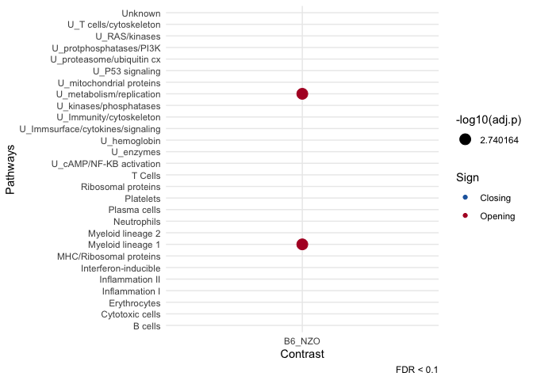

<!-- README.md is generated from README.Rmd. Please edit that file -->

# cinaR <a href='https://eonurk.github.io/cinaR/'></a>

<!-- badges: start -->

[](https://travis-ci.com/eonurk/cinaR)
[](https://github.com/eonurk/cinaR/actions)
<!-- badges: end -->

## Overview

`cinaR` is a single wrapper function for end-to-end computational
analyses of bulk ATAC-seq profiles. It starts from a consensus peak file
and outputs Differentially Accessible (DA) peaks and Enrichment Analyses
results.

## Installation

``` r
library(devtools)
install_github("eonurk/cinaR")
```

## Quick Start

``` r
library(cinaR)
data("atac_seq_consensus_bm")

contrasts<- c("B6", "B6", "B6", "B6", "B6", "NZO", "NZO", "NZO", "NZO", "NZO", "NZO", 
              "B6", "B6", "B6", "B6", "B6", "NZO", "NZO", "NZO", "NZO", "NZO", "NZO")

results <- cinaR(bed, contrasts, reference.genome = "mm10")
#> 
#> >> preparing features information...      2020-10-22 12:26:39 
#> >> identifying nearest features...        2020-10-22 12:26:41 
#> >> calculating distance from peak to TSS...   2020-10-22 12:26:41 
#> >> assigning genomic annotation...        2020-10-22 12:26:41 
#> >> assigning chromosome lengths           2020-10-22 12:27:12 
#> >> done...                    2020-10-22 12:27:12 
#> >> Method: edgeR
#>  FDR: 0.05 & abs(logFC)< 0 
#> >> Estimating dispersion...
#> >> Fitting GLM...
#> >> DA peaks are found!
#> >> No `geneset` is specified so immune modules (Chaussabel, 2008) will be used!
#> >> enrichment.method` is not selected. Hyper-geometric p-value (HPEA) will be used!
#> >> Human gene symbols are converted to mice!
#> >> Enrichment results are ready...
#> >> Done!
```

``` r
pca_plot(results, contrasts, show.names = F)
```


``` r
heatmap_plot(results)
```


``` r
dot_plot(results)
#> Warning: Removed 54 rows containing missing values (geom_point).
```



## Contribution

You can send pull requests to make your contributions.

I occasionally mess up, so all comments are appreciated\!

## Future work

1.  ~~Add enrichment pipeline~~

<!-- end list -->

  - ~~hyper-geometric p-value~~
  - ~~geneset enrichment analyses~~
  - ~~make it compitable with `.gmt` format~~

<!-- end list -->

2.  Visualization of Enrichment Results

<!-- end list -->

  - ~~Dot plot~~
  - Network plot

<!-- end list -->

3.  Small improvements

<!-- end list -->

  - save enrichment files to excel
  - ~~make SV number an argument~~
  - pass `...` into several functions

## Author

  - [E Onur Karakaslar](https://eonurk.github.io/)

## License

  - GNU General Public License v3.0
