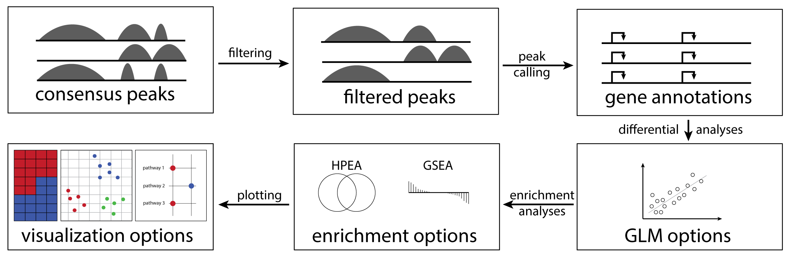

<!-- README.md is generated from README.Rmd. Please edit that file -->

# cinaR <a href='https://eonurk.github.io/cinaR/'></a>

<!-- badges: start -->

[](https://travis-ci.com/eonurk/cinaR)
[](https://github.com/eonurk/cinaR/actions)
[](https://cran.r-project.org/package=cinaR)
[](https://cran.r-project.org/package=cinaR?color=orange)
<!-- badges: end -->

## Overview

`cinaR` is a single wrapper function for end-to-end computational
analyses of bulk ATAC-seq (or RNA-seq) profiles. Starting from a
consensus peak file, it outputs differentially accessible peaks,
enrichment results, and provides users with various configurable
visualization options. For more details, please see the
[preprint](https://www.biorxiv.org/content/10.1101/2021.03.05.434143v2).



## Installation

``` r
# CRAN mirror
install.packages("cinaR")
```

### Development version

To get bug fix and use a feature from the development version:

``` r
# install.packages("devtools")
devtools::install_github("eonurk/cinaR")
```

### Known Installation Issues

Sometimes bioconductor related packages may not be installed
automatically.  
Therefore, you may need to install them manually:

``` r
BiocManager::install(c("ChIPseeker", "DESeq2", "edgeR", "fgsea","GenomicRanges", "limma", "preprocessCore", "sva", "TxDb.Hsapiens.UCSC.hg38.knownGene", "TxDb.Hsapiens.UCSC.hg19.knownGene", "TxDb.Mmusculus.UCSC.mm10.knownGene"))
```

## Contribution

You can send pull requests to make your contributions.

## Author

  - [E Onur Karakaslar](https://eonurk.github.io/)

## License

  - GNU General Public License v3.0
