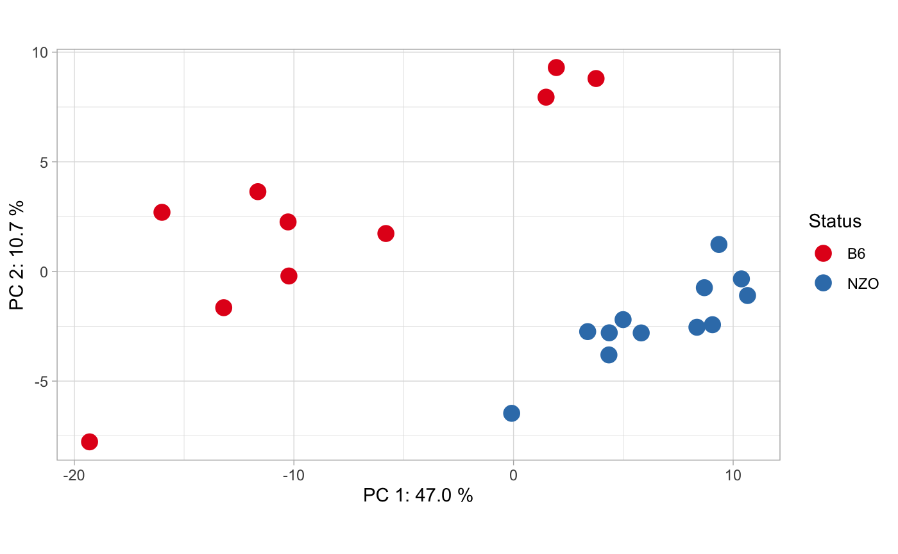
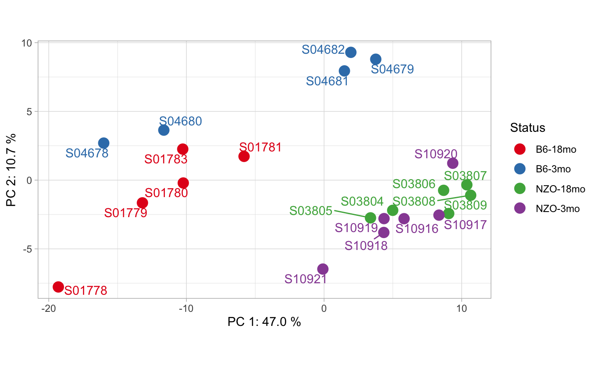
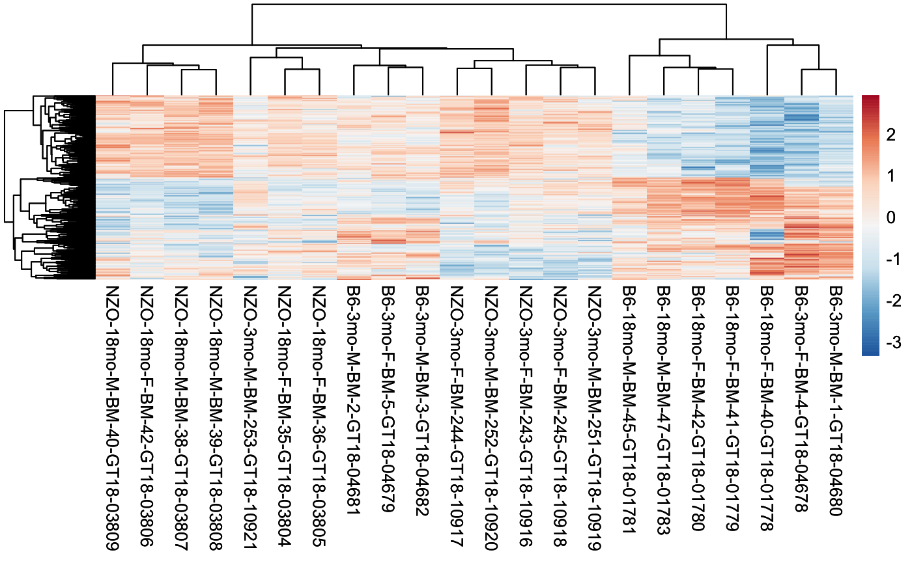
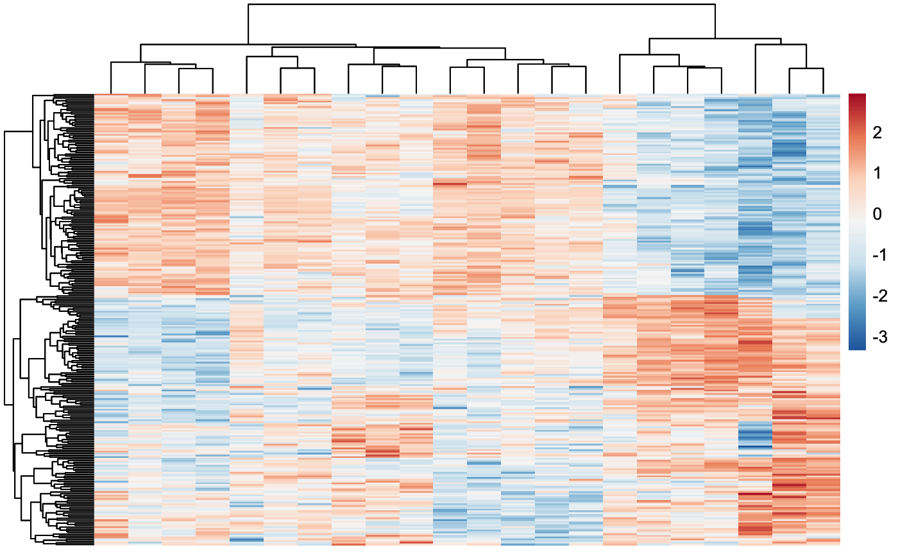
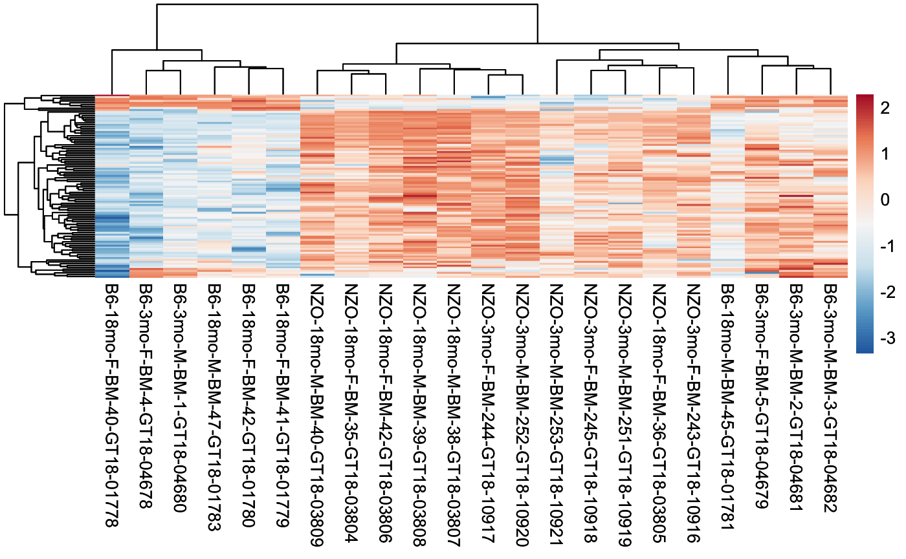
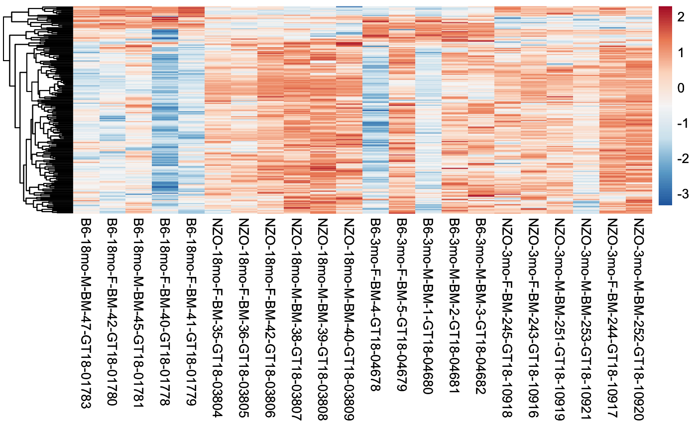
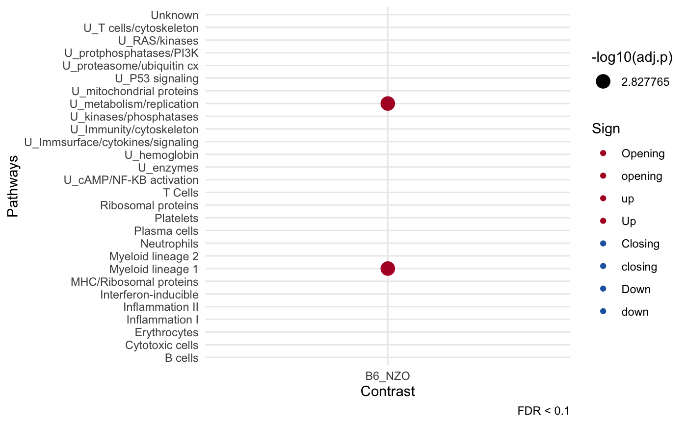
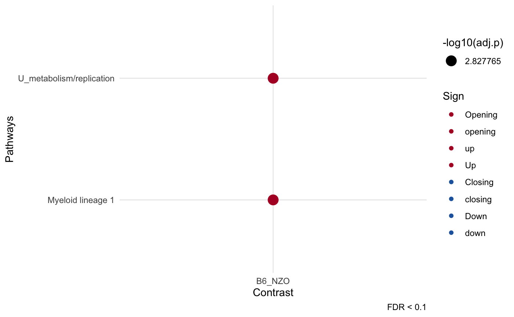

# Introduction to cinaR

    ## 

## Quick Start

``` r
library(cinaR)
data("atac_seq_consensus_bm")
```

Bed formatted consensus matrix (chr, start, end and samples)

``` r
dim(bed)
```

    ## [1] 1000   25

``` r
# bed formatted file
head(bed[,1:4])
```

    ##         Chr     Start       End B6-18mo-M-BM-47-GT18-01783
    ## 52834  chr5  24841478  24845196                       1592
    ## 29780 chr17   8162955   8164380                        109
    ## 67290  chr8  40577584  40578029                         72
    ## 51295  chr4 145277698 145278483                        110
    ## 4267   chr1 180808752 180815472                       2452
    ## 45102  chr3  88732151  88732652                         49

Create the contrasts you want to compare, here we create contrasts for
22 mice samples from different strains.

``` r
# create contrast vector which will be compared.
contrasts<- c("B6", "B6", "B6", "B6", "B6", "NZO", "NZO", "NZO", "NZO", "NZO", "NZO", 
              "B6", "B6", "B6", "B6", "B6", "NZO", "NZO", "NZO", "NZO", "NZO", "NZO")
```

`cinaR` function directly computes the differentially accessible peaks.

``` r
# If reference genome is not set hg38 will be used!
results <- cinaR(bed, contrasts, reference.genome = "mm10")
```

    ## >> preparing features information...      2026-02-02 12:20:04 
    ## >> Using Genome: mm10 ...
    ## >> identifying nearest features...        2026-02-02 12:20:05 
    ## >> calculating distance from peak to TSS...   2026-02-02 12:20:05 
    ## >> assigning genomic annotation...        2026-02-02 12:20:05 
    ## >> Using Genome: mm10 ...
    ## >> Using Genome: mm10 ...
    ## >> assigning chromosome lengths           2026-02-02 12:20:20 
    ## >> done...                    2026-02-02 12:20:20

Now, you can access differential accessibility (DA) and enrichment
results.

``` r
names(results)
```

    ## [1] "DA.results"         "Enrichment.Results"

Inside `DA.results`, you have the consensus peaks (cp) and
differentially accessible (DA) peaks. If batch correction was run, then
`cp` will be a batch-corrected consensus matrix, otherwise it is the
filtered and normalized version of original consensus peaks you
provided.

``` r
names(results$DA.results)
```

    ## [1] "cp"       "DA.peaks"

There are many information `cinaR` provides such as adjusted p value,
log fold-changes, gene names etc for each peak:

``` r
colnames(results$DA.results$DA.peaks$B6_NZO)
```

    ##  [1] "Row.names"     "seqnames"      "start"         "end"          
    ##  [5] "width"         "strand"        "annotation"    "geneChr"      
    ##  [9] "geneStart"     "geneEnd"       "geneLength"    "geneStrand"   
    ## [13] "geneId"        "transcriptId"  "distanceToTSS" "gene_name"    
    ## [17] "logFC"         "FDR"

Here is an overview of those DA peaks:

``` r
head(results$DA.results$DA.peaks$B6_NZO[,1:5])
```

    ##                  Row.names seqnames     start       end width
    ## 1 chr1_134559439_134560787     chr1 134559439 134560787  1349
    ## 2 chr1_138158514_138159483     chr1 138158514 138159483   970
    ## 3 chr1_164247654_164251852     chr1 164247654 164251852  4199
    ## 4 chr1_171631196_171631780     chr1 171631196 171631780   585
    ## 5 chr1_173954537_173955745     chr1 173954537 173955745  1209
    ## 6 chr1_177935969_177936852     chr1 177935969 177936852   884

> Since the comparison is `B6_NZO`, if fold-changes are positive it
> means they are more accesible in B6 compared to NZO and vice versa for
> negative values!

and here is a little overview for enrichment analyses results:

``` r
head(results$Enrichment.Results$B6_NZO[,c("module.name","overlapping.genes", "adj.p")])
```

    ##                 module.name                   overlapping.genes      adj.p
    ## 1         Myeloid lineage 1 TFEB,FBXL5,PLXNC1,GM2A,AGTPBP1,CTSB 0.06643636
    ## 2  U_metabolism/replication             SLC2A6,GM2A,CTSB,PECAM1 0.06643636
    ## 3  U_mitochondrial proteins     PIK3R1,PAQR3,UBE3A,MAP4K4,PTPRC 0.36971894
    ## 4 U_proteasome/ubiquitin cx                  PIK3R1,IREB2,PTPRC 0.42321080
    ## 5   U_Immunity/cytoskeleton                          RPS6,RPS19 0.70414223
    ## 6         Myeloid lineage 2                        RNF157,MTUS1 0.70947467

### PCA Plots

You can easily get the PCA plots of the samples:

``` r
pca_plot(results, contrasts, show.names = F)
```



You can overlay different information onto PCA plots as well!

``` r
# Overlaid information
overlaid.info <- c("B6-18mo", "B6-18mo", "B6-18mo", "B6-18mo", "B6-18mo", 
                   "NZO-18mo", "NZO-18mo", "NZO-18mo", "NZO-18mo", "NZO-18mo", "NZO-18mo", 
                   "B6-3mo", "B6-3mo", "B6-3mo", "B6-3mo", "B6-3mo", 
                   "NZO-3mo", "NZO-3mo", "NZO-3mo", "NZO-3mo", "NZO-3mo", "NZO-3mo")
# Sample IDs
sample.names <- c("S01783", "S01780", "S01781", "S01778", "S01779", 
"S03804", "S03805", "S03806", "S03807", "S03808", 
"S03809", "S04678", "S04679", "S04680", "S04681", 
"S04682", "S10918", "S10916", "S10919", "S10921", 
"S10917", "S10920")
```

``` r
pca_plot(results, overlaid.info, sample.names)
```



### Heatmaps

#### Differential peaks

You can see the available comparisons using:

``` r
show_comparisons(results)
```

    ## [1] "B6_NZO"

Then, plot the differential peaks for a selected contrast using:

``` r
heatmap_differential(results, comparison = "B6_NZO")
```



Also, you can configure your heatmaps using the additional arguments of
`pheatmap` function. For more information check out `?pheatmap`.

``` r
heatmap_differential(results, comparison = "B6_NZO", show_colnames = FALSE)
```



#### Most variable peaks

You can also plot most variable 100 peaks for all samples:

``` r
heatmap_var_peaks(results)
```



Plus, you can set the number of peaks to be used in these plots, and
again you can change the additional arguments of `pheatmap` function.
For more information check out `?pheatmap`.

``` r
heatmap_var_peaks(results, heatmap.peak.count = 200, cluster_cols = F)
```



### Enrichment Plots

You can plot your enrichment results using:

``` r
dot_plot(results)
```

    ## Warning: Removed 54 rows containing missing values or values outside the scale range
    ## (`geom_point()`).



if it gets too crowded, you can get rid of the irrelevant pathways as
well:

``` r
dot_plot(results, filter.pathways = T)
```



## Creating different contrasts

Note that you can further divide the resolution of contrasts, for
instance this is also a valid vector

``` r
contrasts <- sapply(strsplit(colnames(bed), split = "-", fixed = T), 
                    function(x){paste(x[1:4], collapse = ".")})[4:25]
unique(contrasts)
```

    ## [1] "B6.18mo.M.BM"  "B6.18mo.F.BM"  "NZO.18mo.F.BM" "NZO.18mo.M.BM"
    ## [5] "B6.3mo.F.BM"   "B6.3mo.M.BM"   "NZO.3mo.F.BM"  "NZO.3mo.M.BM"

in this case, each of them will be compared to each other which will
result in 28 different comparisons.

## Comparison scheme

As default, `cinaR` will use one vs one (OVA) scheme, comparing each
contrast to others one by one. However, this can be changed to one vs
all (OVA) which will compare each contrast to rest:

```
# one-vs-one (results in n choose k comparisons, default)
cinaR(..., comparison.scheme = "OVO")

# one-vs-all (results in n comparisons)
cinaR(..., comparison.scheme = "OVA")
```

## Running for bulk RNA-seq data

To run `cinaR` with RNA-seq experiments, just provide the count matrix,
and specify the experiment type:

``` r
cinaR(matrix = count.matrix, ..., experiment.type = "RNA-Seq")
```

Note that, `count.matrix` should be in the form of $g \times (1 + n)$
where $g$ is the number of genes and $n$ is the number of samples, and
plus one is for gene names.

> Note that currently `cinaR` can only handle gene symbols (e.g. FOSL2,
> FOXA) and ensembl stable IDs (e.g. ENSG00000010404) for both human and
> mice!

## Single-cell ATAC-seq (10x scATAC) preprocessing

`cinaR` is designed for bulk ATAC-seq. For 10x scATAC, first pseudobulk
your peak-by-cell matrix to preserve biological replicates, then run
`cinaR` on the resulting consensus matrix.

``` r
set.seed(1)
counts <- matrix(rpois(4 * 8, lambda = 2), nrow = 4)
rownames(counts) <- c("chr1:1-100", "chr1:101-200", "chr2:1-150", "chr2:151-300")
colnames(counts) <- paste0("cell", 1:8)

meta <- data.frame(
  sample = c("S1", "S1", "S2", "S2", "S3", "S3", "S4", "S4"),
  group = c("A", "A", "A", "A", "B", "B", "B", "B"),
  row.names = colnames(counts),
  stringsAsFactors = FALSE
)

prep <- prep_scATAC_cinaR(
  counts,
  meta,
  sample.col = "sample",
  group.col = "group",
  min.cells = 2
)

dim(prep$bed)
```

    ## [1] 4 7

``` r
prep$contrasts
```

    ##  S1  S2  S3  S4 
    ## "A" "A" "B" "B"

You can then pass `prep$bed` and `prep$contrasts` to
[`cinaR()`](https://eonurk.github.io/cinaR/reference/cinaR.md) as usual.

## Running enrichment with different dataset

You can run the enrichment analyses with a custom gene set:

``` r
cinaR(..., geneset = new_geneset)
```

#### `cinaRgenesets`

Easiest way to do this is to use
[cinaRgenesets](https://github.com/eonurk/cinaR-genesets) package. You
can select your gene set of interest and just plug it into your
pipeline.

#### MSigDB

You can also download different gene sets from [MSigDB
site](https://www.gsea-msigdb.org/gsea/downloads.jsp). Note that you
should use the human gene symbol versions.

> You can use `read.gmt` function from `qusage` package to read these
> genesets into your current environment.

#### Custom gene sets

A `geneset` must be a `.gmt` formatted symbol file.  
You can familiarize yourself with the format by checking out :

``` r
# default geneset to be used
data("VP2008")
```

> If you have gene and pathway names in a `data.frame`, you can use
> `split` function to create your own `.gmt` formatted gene sets
> e.g. `split(df$genes, df$pathways)`.

## Selecting different reference genomes

For now, `cinaR` supports 3 genomes for human and mice models:

- `hg38`
- `hg19`
- `mm10`

You can set your it using `reference.genome` argument.

## Batch Effect Correction

If you suspect your data have unknown batch effects, you can use:

``` r
cinaR(..., batch.correction = T)
```

This option will run [Surrogate Variable
Analysis](https://bioconductor.org/packages/release/bioc/html/sva.html)
(SVA) and try to adjust your data for unknown batch effects. If however,
you already know the batches of the samples, you can simply set the
`batch.information` argument as well. This will not run the SVA but just
add the batches to design matrix.

``` r
# runs SVA
cinaR(..., batch.correction = T)

# runs SVA with 2 surrogate variables
cinaR(..., batch.correction = T, sv.number = 2)

# adds only batch information to the design matrix! (does not run SVA)
# batch.information should be number a vector where
# the length of it equals to the number of samples.
cinaR(..., batch.correction = T, batch.information = c(rep(0, 11), rep(1,11)))
```

> Reminder - In our example data we have 22 samples

## Adding extra covariates

Sometimes, one might want to add additional covariates to adjust the
design matrix further, which affects the down-stream analyses. For
instance, ages or sexes of the samples could be additional covariates.
To account for those:

``` r
# Ages of the samples could be not in biological interests but should be accounted for!
cinaR(..., additional.covariates = c((18, 11), (3, 11)))

# More than one covariate for instance, sex and age
sex.info <- c("M", "F", "M", "F", "F", "F", "F", "F", "M", "M", "M", 
              "F", "F", "M", "M", "M", "F", "F", "M", "M", "F", "M")

age.info <- c((18, 11), (3, 11)
covs <- data.frame(Sex = sex.info, Age = age.info)

cinaR(..., additional.covariates = covs)
```

## Saving DA peaks to excel

Setting `save.DA.peaks = TRUE` in `cinaR` function will create a
`DApeaks.xlsx` file in the current directory. This file includes all the
comparisons in different tabs. Additionally, you can set the path/name
of the file using `DA.peaks.path` argument after setting
`save.DA.peaks = TRUE`.

For instance,

``` r
results <- cinaR(..., save.DA.peaks = T, DA.peaks.path = "./Peaks_mice.xlsx")
```

will create an excel file with name `Peaks_mice.xlsx` in the current
directory.

## Using different GLM algorithms

Currently, `cinaR` supports 4 different algorithms, namely;

- edgeR
- limma-voom
- limma-trend
- DESeq2

If not set, it uses `edgeR` for differential analyses. You can change
the used algorithm by simply setting `DA.choice` argument. For more
information,
[`?cinaR`](https://eonurk.github.io/cinaR/reference/cinaR.md)

## Some useful arguments

``` r
# new FDR threshold for DA peaks
results <- cinaR(..., DA.fdr.threshold = 0.1)

# filters out pathways
results <- cinaR(..., enrichment.FDR.cutoff = 0.1)

# does not run enrichment pipeline
results <- cinaR(..., run.enrichment = FALSE)

# creates the piechart from chIpSeeker package
results <- cinaR(..., show.annotation.pie = TRUE)

# change cut-off value for dot plots
dot_plot(..., fdr.cutoff = 0.05)
```

## References

- Robinson MD, McCarthy DJ, Smyth GK (2010). “edgeR: a Bioconductor
  package for differential expression analysis of digital gene
  expression data.” Bioinformatics, 26(1), 139-140. doi:
  10.1093/bioinformatics/btp616.

- Ritchie ME, Phipson B, Wu D, Hu Y, Law CW, Shi W, Smyth GK (2015).
  “limma powers differential expression analyses for RNA-sequencing and
  microarray studies.” Nucleic Acids Research, 43(7), e47.

- Love, M.I., Huber, W., Anders, S. (2014) Moderated estimation of fold
  change and dispersion for RNA-seq data with DESeq2. Genome Biology,
  15:550. 10.1186/s13059-014-0550-8

## Session Info

``` r
sessionInfo()
```

    ## R version 4.5.2 (2025-10-31)
    ## Platform: x86_64-pc-linux-gnu
    ## Running under: Ubuntu 24.04.3 LTS
    ## 
    ## Matrix products: default
    ## BLAS:   /usr/lib/x86_64-linux-gnu/openblas-pthread/libblas.so.3 
    ## LAPACK: /usr/lib/x86_64-linux-gnu/openblas-pthread/libopenblasp-r0.3.26.so;  LAPACK version 3.12.0
    ## 
    ## locale:
    ##  [1] LC_CTYPE=C.UTF-8       LC_NUMERIC=C           LC_TIME=C.UTF-8       
    ##  [4] LC_COLLATE=C.UTF-8     LC_MONETARY=C.UTF-8    LC_MESSAGES=C.UTF-8   
    ##  [7] LC_PAPER=C.UTF-8       LC_NAME=C              LC_ADDRESS=C          
    ## [10] LC_TELEPHONE=C         LC_MEASUREMENT=C.UTF-8 LC_IDENTIFICATION=C   
    ## 
    ## time zone: UTC
    ## tzcode source: system (glibc)
    ## 
    ## attached base packages:
    ## [1] stats     graphics  grDevices utils     datasets  methods   base     
    ## 
    ## other attached packages:
    ## [1] cinaR_0.2.6
    ## 
    ## loaded via a namespace (and not attached):
    ##   [1] RColorBrewer_1.1-3                       
    ##   [2] jsonlite_2.0.0                           
    ##   [3] tidydr_0.0.6                             
    ##   [4] magrittr_2.0.4                           
    ##   [5] ggtangle_0.1.1                           
    ##   [6] GenomicFeatures_1.62.0                   
    ##   [7] farver_2.1.2                             
    ##   [8] rmarkdown_2.30                           
    ##   [9] fs_1.6.6                                 
    ##  [10] BiocIO_1.20.0                            
    ##  [11] ragg_1.5.0                               
    ##  [12] vctrs_0.7.1                              
    ##  [13] memoise_2.0.1                            
    ##  [14] Rsamtools_2.26.0                         
    ##  [15] RCurl_1.98-1.17                          
    ##  [16] ggtree_4.0.4                             
    ##  [17] htmltools_0.5.9                          
    ##  [18] S4Arrays_1.10.1                          
    ##  [19] TxDb.Hsapiens.UCSC.hg19.knownGene_3.22.1 
    ##  [20] plotrix_3.8-13                           
    ##  [21] curl_7.0.0                               
    ##  [22] SparseArray_1.10.8                       
    ##  [23] gridGraphics_0.5-1                       
    ##  [24] sass_0.4.10                              
    ##  [25] KernSmooth_2.23-26                       
    ##  [26] bslib_0.10.0                             
    ##  [27] htmlwidgets_1.6.4                        
    ##  [28] desc_1.4.3                               
    ##  [29] plyr_1.8.9                               
    ##  [30] cachem_1.1.0                             
    ##  [31] GenomicAlignments_1.46.0                 
    ##  [32] igraph_2.2.1                             
    ##  [33] lifecycle_1.0.5                          
    ##  [34] pkgconfig_2.0.3                          
    ##  [35] Matrix_1.7-4                             
    ##  [36] R6_2.6.1                                 
    ##  [37] fastmap_1.2.0                            
    ##  [38] MatrixGenerics_1.22.0                    
    ##  [39] digest_0.6.39                            
    ##  [40] aplot_0.2.9                              
    ##  [41] enrichplot_1.30.4                        
    ##  [42] ggnewscale_0.5.2                         
    ##  [43] patchwork_1.3.2                          
    ##  [44] AnnotationDbi_1.72.0                     
    ##  [45] S4Vectors_0.48.0                         
    ##  [46] textshaping_1.0.4                        
    ##  [47] GenomicRanges_1.62.1                     
    ##  [48] RSQLite_2.4.5                            
    ##  [49] labeling_0.4.3                           
    ##  [50] polyclip_1.10-7                          
    ##  [51] httr_1.4.7                               
    ##  [52] abind_1.4-8                              
    ##  [53] compiler_4.5.2                           
    ##  [54] withr_3.0.2                              
    ##  [55] bit64_4.6.0-1                            
    ##  [56] fontquiver_0.2.1                         
    ##  [57] S7_0.2.1                                 
    ##  [58] BiocParallel_1.44.0                      
    ##  [59] DBI_1.2.3                                
    ##  [60] gplots_3.3.0                             
    ##  [61] ggforce_0.5.0                            
    ##  [62] R.utils_2.13.0                           
    ##  [63] MASS_7.3-65                              
    ##  [64] ChIPseeker_1.46.1                        
    ##  [65] rappdirs_0.3.4                           
    ##  [66] DelayedArray_0.36.0                      
    ##  [67] rjson_0.2.23                             
    ##  [68] caTools_1.18.3                           
    ##  [69] gtools_3.9.5                             
    ##  [70] tools_4.5.2                              
    ##  [71] scatterpie_0.2.6                         
    ##  [72] ape_5.8-1                                
    ##  [73] R.oo_1.27.1                              
    ##  [74] glue_1.8.0                               
    ##  [75] restfulr_0.0.16                          
    ##  [76] nlme_3.1-168                             
    ##  [77] GOSemSim_2.36.0                          
    ##  [78] grid_4.5.2                               
    ##  [79] cluster_2.1.8.1                          
    ##  [80] reshape2_1.4.5                           
    ##  [81] fgsea_1.36.2                             
    ##  [82] generics_0.1.4                           
    ##  [83] gtable_0.3.6                             
    ##  [84] R.methodsS3_1.8.2                        
    ##  [85] tidyr_1.3.2                              
    ##  [86] data.table_1.18.2.1                      
    ##  [87] XVector_0.50.0                           
    ##  [88] BiocGenerics_0.56.0                      
    ##  [89] ggrepel_0.9.6                            
    ##  [90] pillar_1.11.1                            
    ##  [91] stringr_1.6.0                            
    ##  [92] limma_3.66.0                             
    ##  [93] yulab.utils_0.2.3                        
    ##  [94] splines_4.5.2                            
    ##  [95] tweenr_2.0.3                             
    ##  [96] dplyr_1.1.4                              
    ##  [97] treeio_1.34.0                            
    ##  [98] lattice_0.22-7                           
    ##  [99] rtracklayer_1.70.1                       
    ## [100] bit_4.6.0                                
    ## [101] tidyselect_1.2.1                         
    ## [102] locfit_1.5-9.12                          
    ## [103] fontLiberation_0.1.0                     
    ## [104] GO.db_3.22.0                             
    ## [105] Biostrings_2.78.0                        
    ## [106] knitr_1.51                               
    ## [107] TxDb.Mmusculus.UCSC.mm10.knownGene_3.10.0
    ## [108] fontBitstreamVera_0.1.1                  
    ## [109] IRanges_2.44.0                           
    ## [110] Seqinfo_1.0.0                            
    ## [111] edgeR_4.8.2                              
    ## [112] SummarizedExperiment_1.40.0              
    ## [113] stats4_4.5.2                             
    ## [114] xfun_0.56                                
    ## [115] Biobase_2.70.0                           
    ## [116] statmod_1.5.1                            
    ## [117] matrixStats_1.5.0                        
    ## [118] pheatmap_1.0.13                          
    ## [119] stringi_1.8.7                            
    ## [120] UCSC.utils_1.6.1                         
    ## [121] lazyeval_0.2.2                           
    ## [122] ggfun_0.2.0                              
    ## [123] yaml_2.3.12                              
    ## [124] boot_1.3-32                              
    ## [125] evaluate_1.0.5                           
    ## [126] codetools_0.2-20                         
    ## [127] cigarillo_1.0.0                          
    ## [128] gdtools_0.4.4                            
    ## [129] tibble_3.3.1                             
    ## [130] qvalue_2.42.0                            
    ## [131] BiocManager_1.30.27                      
    ## [132] ggplotify_0.1.3                          
    ## [133] cli_3.6.5                                
    ## [134] systemfonts_1.3.1                        
    ## [135] jquerylib_0.1.4                          
    ## [136] Rcpp_1.1.1                               
    ## [137] GenomeInfoDb_1.46.2                      
    ## [138] png_0.1-8                                
    ## [139] XML_3.99-0.20                            
    ## [140] parallel_4.5.2                           
    ## [141] pkgdown_2.2.0                            
    ## [142] ggplot2_4.0.1                            
    ## [143] blob_1.3.0                               
    ## [144] DOSE_4.4.0                               
    ## [145] bitops_1.0-9                             
    ## [146] tidytree_0.4.7                           
    ## [147] ggiraph_0.9.3                            
    ## [148] scales_1.4.0                             
    ## [149] purrr_1.2.1                              
    ## [150] crayon_1.5.3                             
    ## [151] rlang_1.1.7                              
    ## [152] cowplot_1.2.0                            
    ## [153] fastmatch_1.1-8                          
    ## [154] KEGGREST_1.50.0
